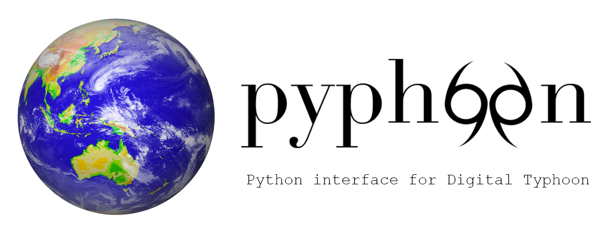

# pyphoon



---

Developed as part of the [Digital Typhoon](http://digital-typhoon.org) project from [Kitamoto-sensei](http://www.nii.ac.jp/en/faculty/digital_content/kitamoto_asanobu/). 
Provides a set of tools to enable easy and pythonic interaction the Digital Typhoon dataset.


**Full documentation [here](http://lcsrg.me/pyphoon)**


## Contents

| **Section**              | **Description**                                                    |
|--------------------------|--------------------------------------------------------------------|
| [pyphoon](pyphooon)      | Library for Digital Typhoon project                                |
| [docs](docs)             | Library documentation files                                        |
| [notebooks](notebooks)   | Example code snippets                                              |
| [scripts](scripts)       | Some example scripts using library tools                           |
| [sampledata](sampledata) | Sample data from Digital Typhoon, used in scripts and notebooks    |


## Installation

Refer to the instructions [here](http://lcsrg.me/pyphoon/build/html/env_setup.html).
 
## Getting started

### Load and visualize sequence

```python

# Load a sequence
from pyphoon.io.h5 import read_source_images
from pyphoon.io.utils import get_image_ids
images = read_source_images('sampledata/datasets/image/200717')
images_ids = get_image_ids('sampledata/datasets/image/200717')

# Display sequence
from pyphoon.visualise import DisplaySequence
DisplaySequence(
    images=images,
    images_ids=images_ids,
    name='200717',
    interval=100
).run()
```


## More

**pyphoon** is being used as a baseline for multiple projects at NII. These, 
once matured, might be added to the main library. For now, they are available
 in their respective repositories.

* [**tcxtc-deep-classifier**](http://github.com/lucasrodes/tcxtc-deep-classifier): Deep Learning for classification of 
typhoon satellite imagery in two categories: Tropical Cyclone and 
Extra-Tropical Cyclone 
