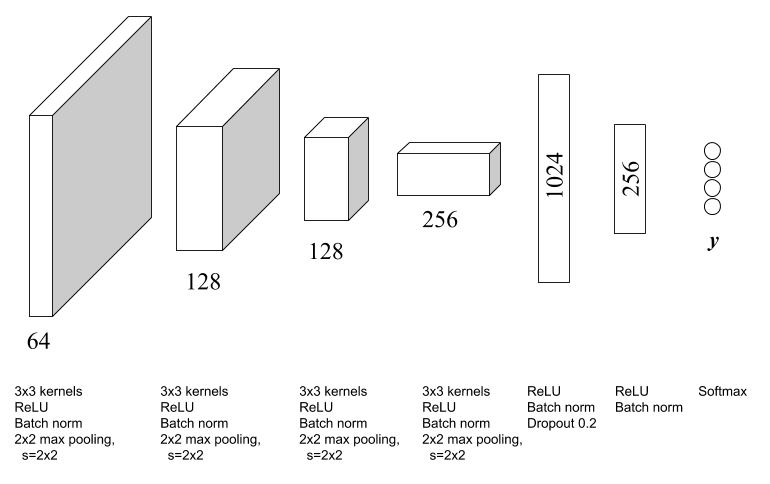

This experiment consists in estimating the class of a *Tropical Cyclone*. 
Classes are defined based on intensity level, which is provided by 
meteorological agencies based on typhoon wind speed and centre pressure 
measurements. 


## Architecture



## Results
Our model achieved nearly **57.83% accuracy** on the test set. For more 
details refer to the examples in 
[notebooks](notebooks). 

### Random Split
We also tested the performance of our model using a random split distribution
between training and test sets. We observe that using completely random 
distribution lead to an accuracy of nearly 82.82% on the test set. However, we 
claim this is not a good practice. More details may be found in Lucas 
Rodés-Guirao thesis and in the notebook 
[Random_Data_Split](notebooks/Random_Data_Split.ipynb).


## Image format

*   Images must be in range of [0, 255], where 0 and 255 correspond to 160 
Kelvin and 310 Kelvin, correspondingly.
*   The model accepts **128x128 images** with **resolution 1 pixel ≈ 10 Km**.
 To this end we crop 128x128 regions from resized Digital Typhoon 256x256 
 images (original images come as 512x512).
*   Images are assumed to have the typhoon eye in the image centre (i.e
. at position [63, 63]).


## Usage in code
You can also use the model in your code.

### Load model

```python
from pyphoon.models.tc_multiclass import tcNet
model = tcNet('weights.hdf5')
```

### Preprocess data

```python
from pyphoon.models.tc_multiclass import tcPreprocessor
X = ...  # Load (1, 256, 256) image or (N, 256, 256) array of images
X = tcPreprocessor().apply(X)
```

### Prediction
Make sure to crop the images so as to take a centred square of dimension 
128x128.

```python
X = X[:, 64:64+128, 64:64+128, :]
Y = model.predict(X)
```