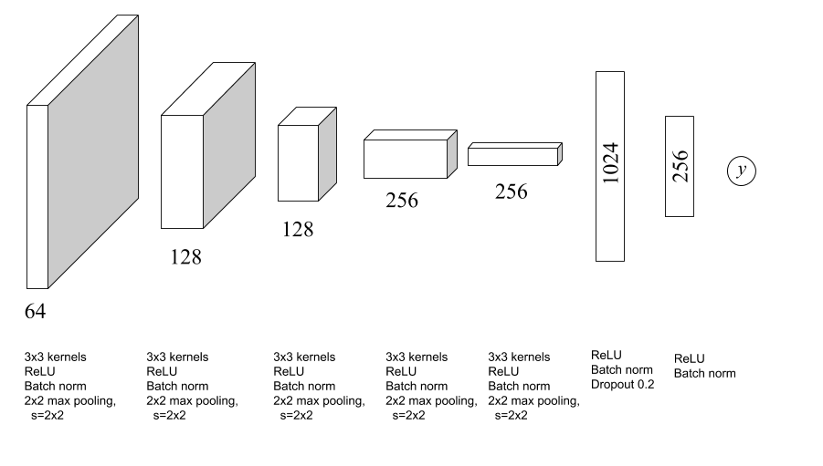
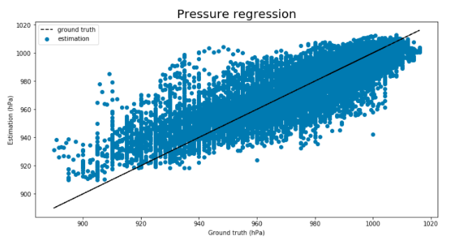
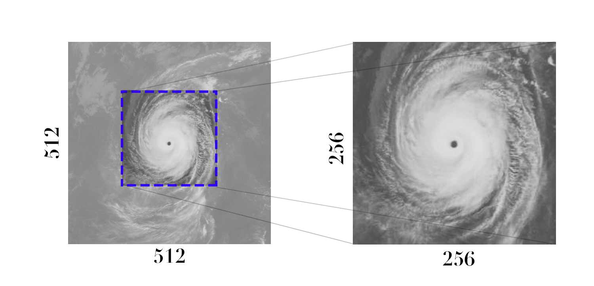

Here you can find the architecture and weights of our model. This model 
achieved a mean error of 7.63 hPa.


## Architecture



## Results


## Image format

*   Images must be in range of [0, 255], where 0 and 255 correspond to 160 
Kelvin and 310 Kelvin, correspondingly.
*   The model accepts **128x128 images** with **resolution 1 pixel ≈ 10 Km**.
 To this end we crop 128x128 regions from resized Digital Typhoon 256x256 
 images (original images come as 512x512).
*   Images are assumed to have the typhoon eye in the image centre (i.e
. at position [63, 63]).



## Usage in code
You can also use the model in your code.

### Load model

```python
from pyphoon.models.tc_pressure_regression import tcRegNet
model = tcRegNet('weights.hdf5')
```

### Preprocess data

```python
from pyphoon.models.tc_pressure_regression import tcRegPreprocessor
X = ...  # Load (1, 256, 256) image or (N, 256, 256) array of images
X = tcRegPreprocessor().apply(X)
```

### Prediction
Make sure to crop the images so as to take a centred square of dimension 
128x128.

```python
X = X[:, 64:64+128, 64:64+128, :]
y_pred = model.predict(X)
```


