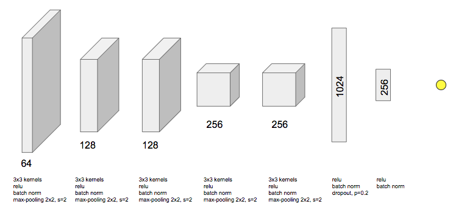

Here you can find the architecture and weights of our model. This model 
achieved a mean error of 7.8 hPa.


## Architecture



## Using the model

### Download weights
You can download model's weights [here](https://mega.nz/#!j7BRGJaI!vCLq9VBSR-Gyj_c7On5KCaMTe7AkwlfZx3DBG9EMl6M).

### Load the model

```python
from architecture import pressureRegressionModel
model = pressureRegressionModel()
model.load_weights('weights-improvement-09-8.02.hdf5')
```

### Usage

#### Preprocessing
Make sure to preprocess the data before feeding it to the model.

```python
import h5py

# Load preprocessing parameters
with h5py.File('preprocessing_sequence.h5') as f:
    mean = f.get('image_mean_128').value
    scale_factor = f.get('max_value_128').value - f.get('min_value_128').value
```

#### Getting predictions
Model requires input `X` to be of shape `(N, 128, 128, 1)`, where `N` denotes 
the number of samples. 

```python
model.predict(X)
```

## Results

