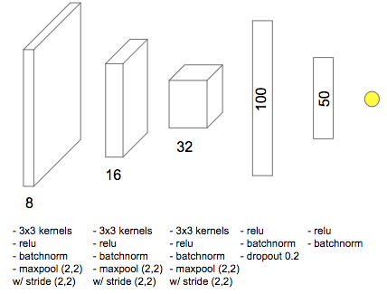

This task consists in estimating a phenomenon illustrated on an image is a 
*Tropical cyclone* or an *Extratropical cyclone*.


## Architecture



## Results
Our model achieved nearly **94.65% accuracy** on the validation set and **94.9% 
accuracy** on the test set. For more details refer to the examples in 
[notebooks](notebooks). 


## Image format

*   Images should be in range of [0, 255], where 0 and 255 correspond to 160 
Kelvin and 255 Kelvin, correspondingly.
*   The model accepts **256x256 images** with **resolution 1 pixel ≈ 10 Km**.
*   Images are assumed to have the typhoon eye in the image centre (i.e
. at position [127, 127]).

## Usage in code
You can also use the model in your code.

### Load model

```python
from pyphoon.models.tcxtc import tcxtcNet
model = tcxtcNet('weights.hdf5')
```

### Preprocess data

```python
from pyphoon.models.tcxtc import tcxtcPreprocessor
X = ...  # Load (1, 256, 256) image or (N, 256, 256) array of images
preprocessor = tcxtcPreprocessor()
X = preprocessor.apply(X)
```

### Prediction

```python
Y = model.predict(X)
```