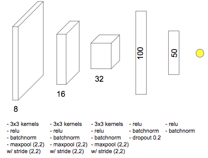

This task consists in estimating a phenomenon illustrated on an image is a 
*Tropical cyclone* or an *Extratropical cyclone*.


## Architecture



## Results
Our model achieved nearly **96.27% accuracy** on the validation set and **94
.9% accuracy** on the test set. For more details refer to the examples in 
[notebooks](notebooks). 


## Image format

Images should be in range of [0, 255], where 0 and 255 correspond to 160 Kelvin 
and 255 Kelvin, correspondingly.

## Using the model in code
Alternatively, you can use this model in your code.

### Load model

```python
from pyphoon.app.models.tcxtc import tcxtcNet
model = tcxtcNet('weights.hdf5')
```

### Preprocess data

```python
import h5py

# Load preprocessing parameters
with h5py.File('preprocessing_year.h5.h5') as f:
    mean = f.get('image_mean').value
    scale_factor = f.get('max_value').value - f.get('min_value').value

X = ...  # Load (256, 256) image or (N, 256, 256) array of images
X = (X - mean )/scale_factor
```

### Prediction

```python
Y = model.predict(X)
```